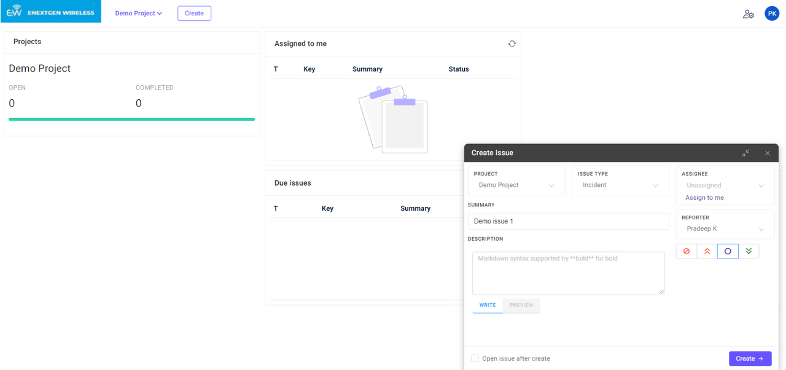
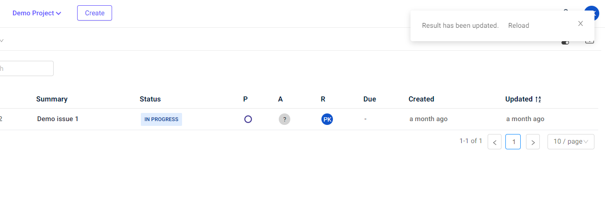
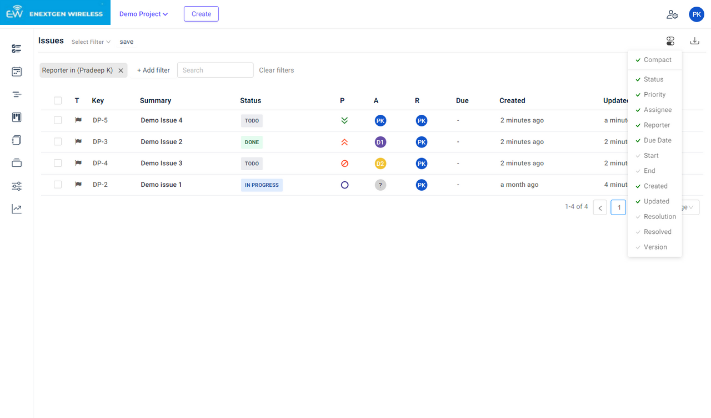
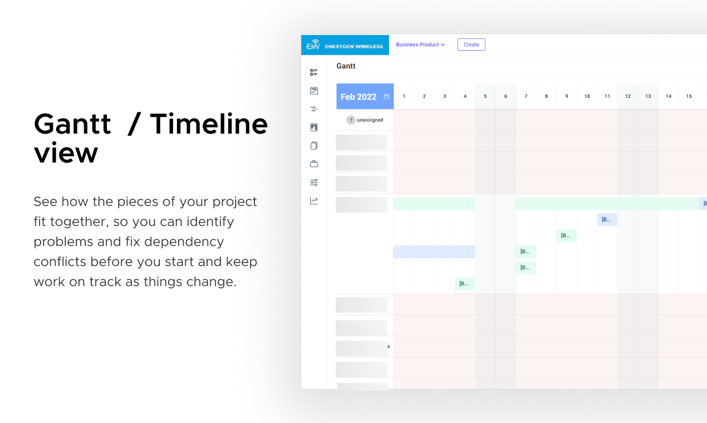
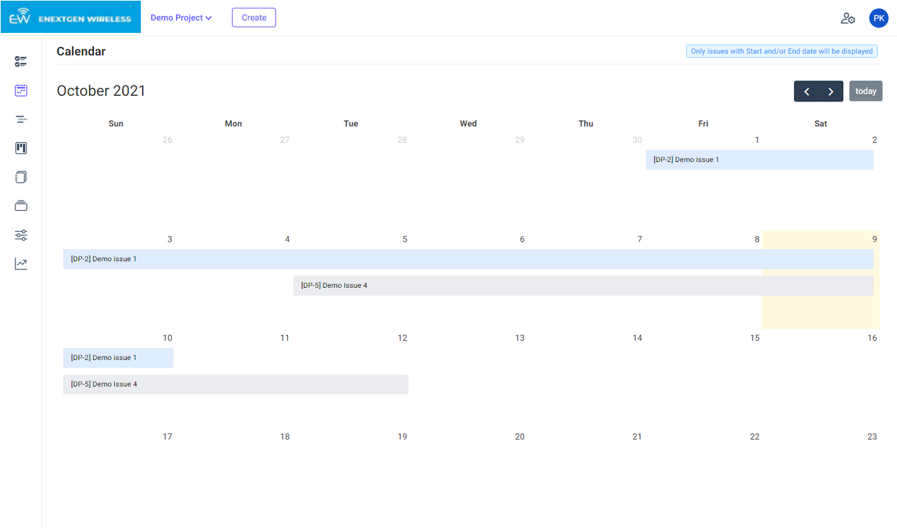

# Issue features <!-- {docsify-ignore} -->

## Overview

* Checklist
* Attachments (Drag and Drop / Select file and upload)
* Issue Linking
* Web links
* Time Tracking
* Comments
* Priority
* Labels
* Components

## Create Issue

## Get realtime notification  

If data has been changed in search view / calendar / board / gantt chart

## Search / Filter Issues

Customize issue list display

## Gantt

## Calendar

## Board

